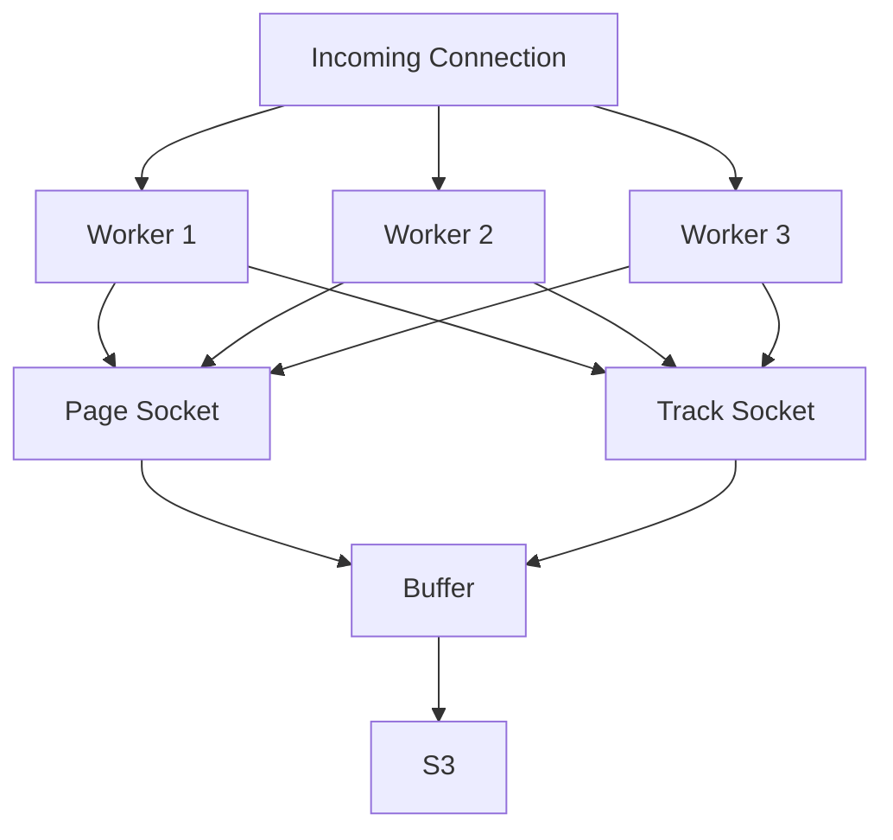

# Segmate

A self-hosted replacement for https://segment.com/.

## Project Goals

  - Compatability with existing analytics clients
  - Simplicity to for reliability
  - Performance for low cost and easy scaling
  - The only destination is S3 as Parquet

## How it Works

[Socket Sharding](https://www.f5.com/company/blog/nginx/socket-sharding-nginx-release-1-9-1) is used to point multiple listeners to the same port.

An incoming connection is given to one of the listeners by the kernel, then it does some lightweight verification of the request to accept/reject before copying the body to a different dedicated socket. It then returns success to the client.

There is a dedicated socket per type to support pre-allocating buffers. A dedicated worker listens to each of these interally used sockets and aggregates the data. It aggregates the data in a buffer until 5mb worth is received or a time limit is reached, then it writes it to S3.

### Notes

Performance:
- https://github.com/gofiber/fiber/issues/2780
- https://github.com/valyala/fasthttp#performance-optimization-tips-for-multi-core-systems

Deployment:
- https://github.com/TechEmpower/FrameworkBenchmarks/blob/master/frameworks/Go/fiber/fiber-prefork.dockerfile
- https://github.com/gofiber/fiber/issues/1021
